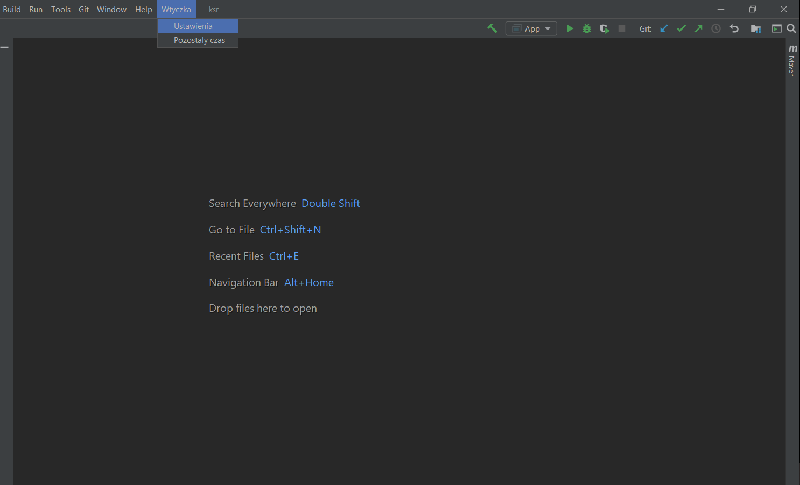
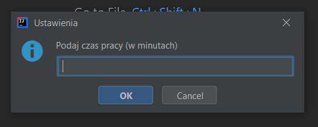
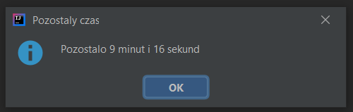
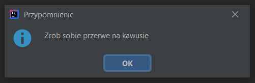

# Kozak plugin do Intellij 

Plugin powstał z myślą o biednych, ciężko pracujących studentach,
którzy w transie programowania potrafią zapomnieć o tak podstawowych
potrzebach życiowych, jak picie kawy, picie herbaty lub picie kawy. 
Poza tym, że przerwa, o której często zapominamy, jest zdrowa dla kręgosłupa
oraz naszych oczu, to również pozwala się odświeżyć. 

W związku z tym grupa naszych najlepszych deweloperów postanowiła 
przyjrzeć się temu problemowi i spróbować znaleźć jak najprostszy sposób
na pamiętaniu o tych jakże ważnych przerwach.

----
## Wygląd wtyczki

Wtyczka wyświetla się na pasku menu po prawej stronie (zaraz za kafelkiem „Help”).

----
Po wejściu w opcję „Ustawienia” możemy ustawić, po jakim czasie
chcemy zrobić sobie przerwę. Naukowcy zalecają, żeby na każde 
50 min pracy z komputerem, 10 min poświęcić na odpoczynek 
(zrobienie kawy, popatrzenie za okno, pogadanie z psem).

----
Po wejściu w opcję „Pozostały czas” można podejrzeć, ile czasu, zostało
do "przerwy na kawę".

---
Wtyczka po przekroczeniu czasu wyświetla wiadomość informującą, że 
najwyższy czas zrobić sobie przerwę na kawę.

